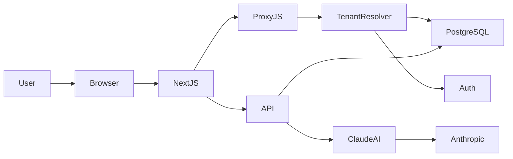

<div align="center">

# mibi 🤖

### AI-powered HR assistant for modern teams

Gestão de Recursos Humanos com **multi-tenancy, automação e inteligência artificial**.

[Demo](https://demonstracao.rh.lucaskarsten.com.br) • [API Docs](https://demonstracao.rh.lucaskarsten.com.br/api/docs)

</div>

---

# ✨ What is mibi

**mibi** é uma plataforma de gestão de RH com **assistente de IA integrado**, projetada para empresas modernas que querem melhorar **feedback, comunicação e processos de pessoas**.

A plataforma permite que múltiplas empresas utilizem o sistema de forma **isolada e segura**, cada uma com seu próprio ambiente.

Principais capacidades:

- gestão de colaboradores
- ciclos de feedback
- revisão automática de feedback por IA
- base de conhecimento de RH
- multi-tenancy real via PostgreSQL schemas

---

# 🌐 Live Demo

Acesse a instância de demonstração:

```
https://demonstracao.rh.lucaskarsten.com.br
```

Login:

```
email: beatriz@demonstracao.com
senha: lucas1
```

---

# 🚀 Why mibi?

Ferramentas tradicionais de RH ainda são **burocráticas, rígidas e pouco inteligentes**.

mibi foi criado para resolver três problemas comuns.

---

## 🧠 Feedback de qualidade é difícil

Escrever feedback claro e construtivo exige prática.

mibi usa **IA para revisar feedbacks**, ajudando gestores a:

- melhorar clareza
- evitar linguagem agressiva
- manter tom construtivo
- seguir políticas internas de RH

---

## 🏢 Ferramentas de RH não escalam bem

Sistemas tradicionais misturam dados de empresas diferentes.

mibi usa **multi-tenancy real**, com:

- isolamento por schema
- segurança entre empresas
- performance previsível

---

## 📚 Conhecimento de RH fica espalhado

Policies e boas práticas geralmente ficam em:

- documentos
- PDFs
- intranet

mibi centraliza isso em uma **base de conhecimento integrada à IA**.

---

# ✨ Principais recursos

## 👥 Gestão de colaboradores

- cadastro de colaboradores
- perfil completo
- permissões por tenant
- controle de acesso

---

## 💬 Ciclo de feedback

- criação de feedback
- histórico
- visibilidade controlada
- revisão automática com IA

---

## 🤖 Assistente de RH com IA

Integração com **Claude Sonnet** da Anthropic.

Capaz de:

- revisar feedbacks
- sugerir melhorias
- analisar linguagem
- aplicar guidelines da empresa

**Neuralizar** é o comando que aciona a IA diretamente na interface, disponível tanto no desktop quanto no mobile.

---

## 🎨 Interface responsiva

A interface foi projetada para funcionar em qualquer dispositivo.

No **desktop**:

- sidebar fixa com navegação completa
- topbar com nome do tenant
- toggle de tema claro/escuro

No **mobile**:

- sidebar colapsável
- topbar dedicada com acesso ao Neuralizar e toggle de tema
- layout adaptado para telas pequenas

O **tema claro/escuro** pode ser alternado a qualquer momento, com contraste reforçado no tema claro para melhor legibilidade.

A tela de login conta com o efeito **neuralFadeIn** (brightness + blur) para uma entrada visual consistente com a identidade do produto.

---

## 🏢 Multi-tenancy

Cada empresa possui um **schema isolado no PostgreSQL**.

Exemplo:

```
tenant_empresa
tenant_startup
tenant_demo
```

Tabelas principais:

```
collaborator
feedback
session
hr_config
ai_learning
```

O tenant é resolvido automaticamente via **subdomínio**.

```
empresa.rhlegal.com.br → tenant_empresa
startup.rhlegal.com.br → tenant_startup
```

---

# 🧠 Arquitetura



A autenticação é tratada pelo **`proxy.js`**, que valida o JWT em cada requisição e redireciona para `/login` caso o token seja inválido ou ausente. Não utiliza o `middleware.js` padrão do Next.js.

As migrações rodam apenas no schema `public`. Os schemas de tenant são criados e gerenciados pela função `provision_tenant()`.

---

# 🏗️ Stack

| Camada        | Tecnologia      |
| ------------- | --------------- |
| Frontend      | React           |
| Framework     | Next.js         |
| Backend       | Node.js         |
| Banco (DEV)   | PostgreSQL local via Docker |
| Banco (PRD)   | NeonDB (PostgreSQL) |
| Migrações     | node-pg-migrate |
| Autenticação  | jose (JWT) via proxy.js |
| Hash de senha | bcrypt          |
| IA            | Claude Sonnet   |
| Testes        | Jest            |
| Infra local   | Docker Compose  |
| Hospedagem    | Vercel          |
| DNS           | Registro.br     |

---

# ⚡ Quick Start

Clone o projeto:

```bash
git clone https://github.com/lucaskarsten/mibi.git
cd mibi
```

Instale dependências:

```bash
npm install
```

Configure variáveis:

```bash
cp .env.development .env.local
```

Inicie o ambiente:

```bash
npm run dev
```

Esse comando automaticamente:

1. sobe PostgreSQL via Docker
2. executa migrações
3. inicia o Next.js

---

# 🔌 API

Principais endpoints:

```
GET  /api/v1/status
POST /api/v1/auth/login

GET  /api/v1/collaborators
POST /api/v1/collaborators

GET  /api/v1/feedback
POST /api/v1/feedback
POST /api/v1/feedback/:id/review

GET  /api/v1/config
PUT  /api/v1/config

POST /api/v1/tenant/provision
```

Documentação completa:

```
/api-docs
```

---

# 🧪 Testes

Rodar testes:

```
npm test
```

Modo watch:

```
npm run test:watch
```

Testes completos:

```
npm run test:integration
```

---

# 🗺️ Roadmap

Próximas evoluções planejadas:

- SSO (Google / Microsoft)
- dashboards analíticos de RH
- ciclo completo de performance review
- integrações Slack
- webhooks
- exportação de relatórios

---

# 🤝 Contribuindo

Contribuições são bem-vindas.

Fluxo recomendado:

```
fork
branch feature/nome-da-feature
commit
pull request
```

---

# 📜 Licença

MIT

---

# 👨‍💻 Autor

Desenvolvido por **Lucas Karsten**
