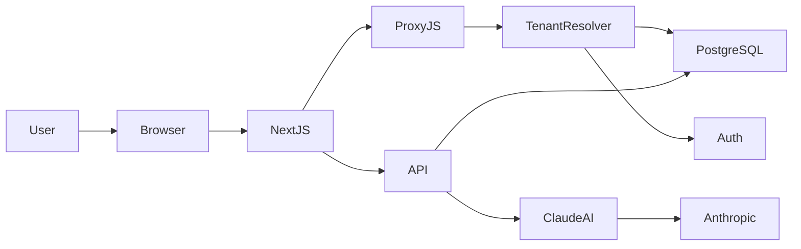

<div align="center">

# mibi 🤖

### AI-powered HR platform for modern teams

Gestão de Recursos Humanos com **multi-tenancy, automação e inteligência artificial**.

[Demo](https://demonstracao.rh.lucaskarsten.com.br) • [API Docs](https://demonstracao.rh.lucaskarsten.com.br/api/docs)

</div>

---

# ✨ What is mibi

**mibi** é uma plataforma de gestão de RH com **assistente de IA integrado**, projetada para empresas modernas que querem melhorar **feedback, comunicação e processos de pessoas**.

A plataforma permite que múltiplas empresas utilizem o sistema de forma **isolada e segura**, cada uma com seu próprio ambiente.

Principais capacidades:

- gestão de colaboradores
- ciclos de feedback com revisão automática por IA
- recuperação de senha com token seguro
- convite de colaboradores por e-mail
- módulo de recrutamento *(em desenvolvimento)*
- base de conhecimento de RH
- multi-tenancy real via PostgreSQL schemas

---

# 🌐 Live Demo

Acesse a instância de demonstração:

```
https://demonstracao.rh.lucaskarsten.com.br
```

Login:

```
email: beatriz@demonstracao.com
senha: lucas1
```

---

# 🚀 Why mibi?

Ferramentas tradicionais de RH ainda são **burocráticas, rígidas e pouco inteligentes**.

mibi foi criado para resolver três problemas comuns.

---

## 🧠 Feedback de qualidade é difícil

Escrever feedback claro e construtivo exige prática.

mibi usa **IA para revisar feedbacks**, ajudando gestores a:

- melhorar clareza
- evitar linguagem agressiva
- manter tom construtivo
- seguir políticas internas de RH

---

## 🏢 Ferramentas de RH não escalam bem

Sistemas tradicionais misturam dados de empresas diferentes.

mibi usa **multi-tenancy real**, com:

- isolamento por schema PostgreSQL
- segurança entre empresas
- performance previsível

---

## 📚 Conhecimento de RH fica espalhado

Policies e boas práticas geralmente ficam em documentos soltos, PDFs ou intranet.

mibi centraliza isso em uma **base de conhecimento integrada à IA**.

---

# ✨ Principais recursos

## 👥 Gestão de colaboradores

- cadastro de colaboradores
- perfil completo
- convite por e-mail com token seguro e prazo de expiração
- permissões por tenant (admin / member)
- controle de acesso por JWT

---

## 🔐 Autenticação completa

mibi possui um fluxo de autenticação robusto:

- **Login** com e-mail e senha
- **Logout** com invalidação de sessão
- **Convite de colaborador** — admin convida, colaborador define a própria senha via token
- **Recuperação de senha** — fluxo completo com geração de token, envio de e-mail e redefinição segura
- **Validação de token** — endpoint dedicado para verificar se um token de reset ainda é válido antes de exibir o formulário

Todos os tokens de segurança (invite, reset) são armazenados com prazo de expiração (`timestamptz`) e são invalidados após o uso.

---

## 💬 Ciclo de feedback

- criação de feedback entre colaboradores
- histórico completo
- visibilidade controlada
- revisão automática com IA

---

## 🤖 Assistente de RH com IA

Integração com **Claude Sonnet** da Anthropic.

Capaz de:

- revisar feedbacks
- sugerir melhorias
- analisar linguagem
- aplicar guidelines da empresa

**Neuralizar** é o comando que aciona a IA diretamente na interface, disponível tanto no desktop quanto no mobile.

---

## 🧑‍💼 Recrutamento *(em desenvolvimento)*

O módulo de recrutamento está sendo construído para dar ao recrutador ferramentas de IA dentro do mesmo ambiente multi-tenant.

Funcionalidades planejadas:

- gerenciamento de vagas
- pipeline de candidatos (triagem → entrevista → oferta)
- análise de currículos com IA
- geração de perguntas de entrevista personalizadas por vaga
- scorecard de candidatos com sugestão de IA
- histórico de processos seletivos por tenant

---

## 🎨 Interface responsiva

A interface foi projetada para funcionar em qualquer dispositivo.

No **desktop**:

- sidebar fixa com navegação completa
- topbar com nome do tenant
- toggle de tema claro/escuro

No **mobile**:

- sidebar colapsável
- topbar dedicada com acesso ao Neuralizar e toggle de tema
- layout adaptado para telas pequenas

O **tema claro/escuro** pode ser alternado a qualquer momento, com contraste reforçado no tema claro para melhor legibilidade.

A tela de login conta com o efeito **neuralFadeIn** (brightness + blur) para uma entrada visual consistente com a identidade do produto.

---

## 🏢 Multi-tenancy

Cada empresa possui um **schema isolado no PostgreSQL**.

Exemplo:

```
tenant_empresa
tenant_startup
tenant_demo
```

Tabelas principais por schema:

```
collaborator
feedback
session
hr_config
ai_learning
```

O tenant é resolvido automaticamente via **subdomínio** ou via header `x-tenant-subdomain` (utilizado em testes e em chamadas internas).

```
empresa.rhlegal.com.br → tenant_empresa
startup.rhlegal.com.br → tenant_startup
```

---

# 🧠 Arquitetura



A autenticação é tratada pelo **`proxy.js`**, que valida o JWT em cada requisição e redireciona para `/login` caso o token seja inválido ou ausente. Não utiliza o `middleware.js` padrão do Next.js.

As migrações rodam apenas no schema `public`. Os schemas de tenant são criados e gerenciados pela função `provision_tenant_schema()`.

---

# 🏗️ Stack

| Camada        | Tecnologia      |
| ------------- | --------------- |
| Frontend      | React           |
| Framework     | Next.js (Pages Router) |
| Backend       | Node.js         |
| Banco (DEV)   | PostgreSQL local via Docker |
| Banco (PRD)   | NeonDB (PostgreSQL serverless) |
| Migrações     | node-pg-migrate |
| Autenticação  | jose (JWT) via proxy.js |
| Hash de senha | bcrypt          |
| IA            | Claude Sonnet (Anthropic) |
| Testes        | Jest (integração) + GitHub Actions CI |
| Infra local   | Docker Compose  |
| Hospedagem    | Vercel          |
| DNS           | Registro.br     |

---

# 🧪 Testes

mibi possui uma suíte de **testes de integração** que sobe o servidor Next.js real e um banco PostgreSQL local, executando chamadas HTTP reais contra a API.

Rodar testes localmente:

```bash
npm test
```

Modo watch:

```bash
npm run test:watch
```

Suíte completa de integração:

```bash
npm run test:integration
```

O CI roda automaticamente via **GitHub Actions** em cada pull request, com:

- PostgreSQL 16 em container Docker
- migrations completas antes dos testes
- build do Next.js (`next build`)
- healthcheck via `wait-on` antes de iniciar os testes
- ambiente idêntico ao de produção

---

# 🔌 API

Principais endpoints:

```
GET  /api/v1/status

POST /api/v1/auth/login
POST /api/v1/auth/logout
POST /api/v1/auth/forgot-password
POST /api/v1/auth/reset-password
GET  /api/v1/auth/validate-reset-token
POST /api/v1/auth/accept-invite

GET  /api/v1/collaborators
POST /api/v1/collaborators
PUT  /api/v1/collaborators/:id
DEL  /api/v1/collaborators/:id

GET  /api/v1/feedback
POST /api/v1/feedback
POST /api/v1/feedback/:id/review

GET  /api/v1/config
PUT  /api/v1/config

POST /api/v1/tenant/provision
GET  /api/v1/knowledge
```

Documentação interativa (Swagger):

```
/api/docs
```

---

# ⚡ Quick Start

Clone o projeto:

```bash
git clone https://github.com/lucaskarsten/mibi-core.git
cd mibi-core
```

Instale dependências:

```bash
npm install
```

Configure variáveis:

```bash
cp .env.development .env.local
```

Inicie o ambiente:

```bash
npm run dev
```

Esse comando automaticamente:

1. sobe PostgreSQL via Docker Compose
2. executa migrações
3. inicia o Next.js em modo desenvolvimento

---

# 🗺️ Roadmap

Próximas evoluções planejadas:

- **Recrutamento** — vagas, pipeline de candidatos, análise de currículo com IA *(em desenvolvimento)*
- SSO (Google / Microsoft)
- dashboards analíticos de RH
- ciclo completo de performance review
- integrações Slack
- webhooks
- exportação de relatórios em PDF

---

# 🤝 Contribuindo

Contribuições são bem-vindas.

Fluxo recomendado:

```
fork
branch feature/nome-da-feature
commit
pull request
```

---

# 📜 Licença

MIT

---

# 👨‍💻 Autor

Desenvolvido por **Lucas Karsten**
