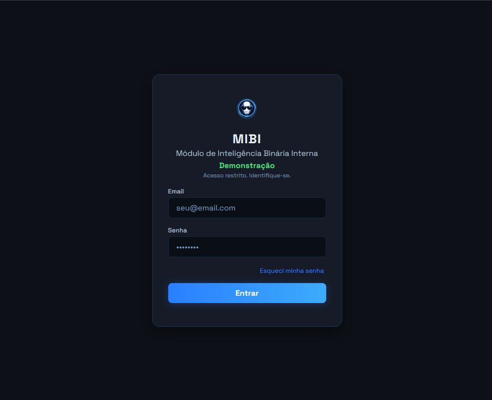
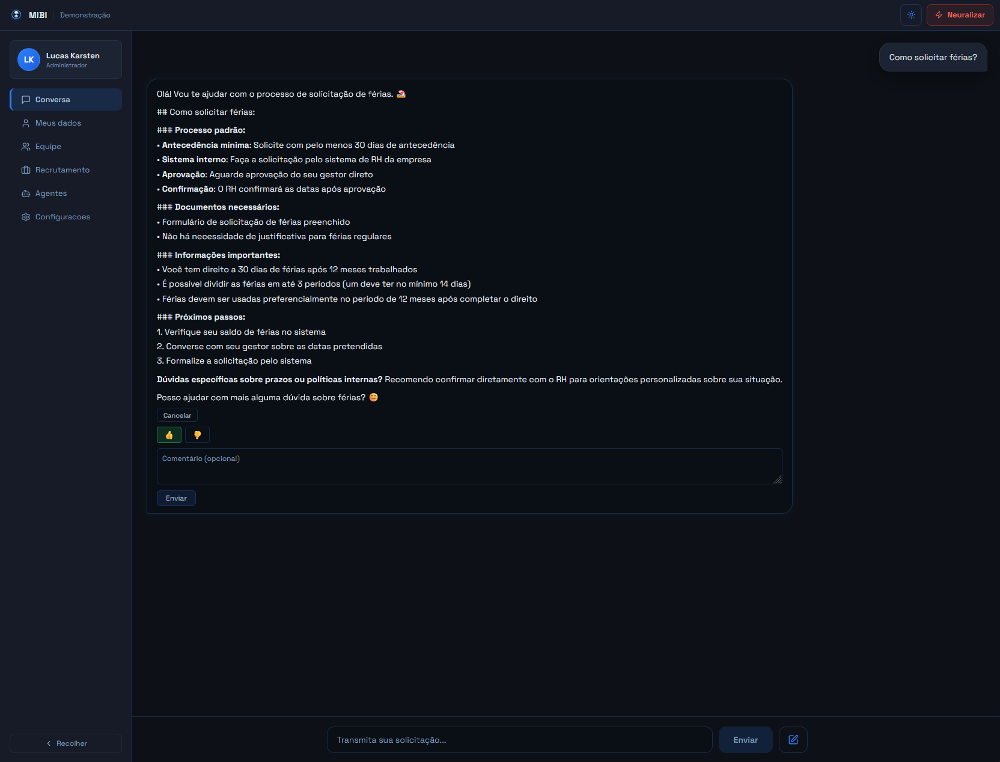
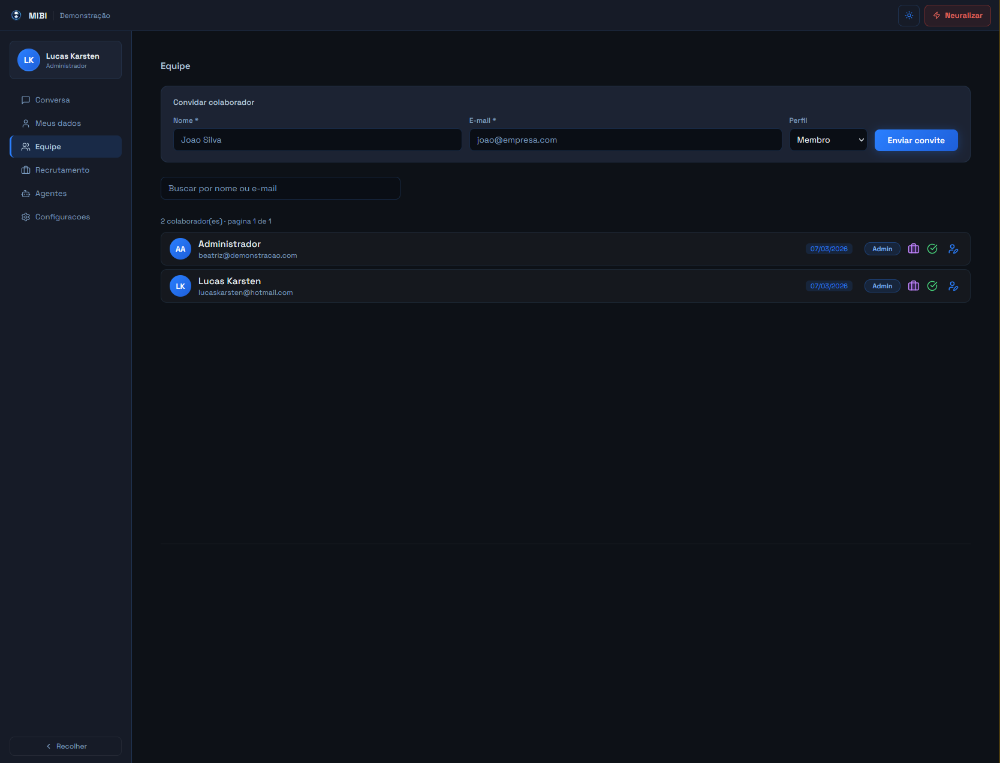
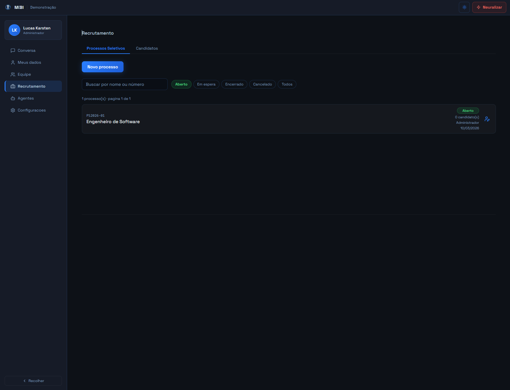
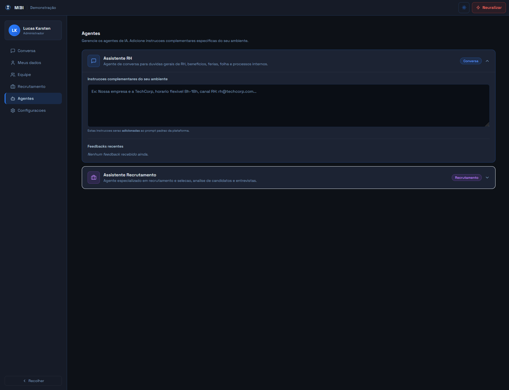

<div align="center">

# mibi

### Plataforma de RH com inteligência artificial para equipes modernas

Gestão de pessoas com **multi-tenancy real, automação inteligente e IA integrada** — tudo em um só lugar.

<br />

[](https://demonstracao.rh.lucaskarsten.com.br)

<br />



</div>

---

## O que é o mibi?

**mibi** é uma plataforma de RH construída para empresas que querem usar inteligência artificial de forma prática no dia a dia de pessoas.

Cada empresa opera em um **ambiente completamente isolado** — com seus próprios dados, agentes de IA personalizados e histórico exclusivo. Sem compartilhamento. Sem risco de vazamento entre organizações.

---

## Funcionalidades

### 🤖 Assistente de RH com IA

O colaborador pergunta. A IA responde — com contexto real da empresa: benefícios, políticas internas, férias, folha de pagamento. Sem precisar abrir chamado ou esperar o RH.

As respostas podem ser copiadas para o clipboard com um clique. O feedback (👍 / 👎) é dado diretamente em cada mensagem — membros enviam na hora, gestores e recrutadores podem adicionar um comentário antes.




---

### 👥 Gestão de Equipe

Visão completa da sua equipe com controle de acesso granular. Suporte a tema claro e escuro.


- Convite por e-mail com link personalizado por empresa
- Controle de papéis: `admin` e `member` por organização
- Flag de recrutador para acesso ao módulo de seleção
- Perfis individuais com histórico de atividades



---

### 🎯 Módulo de Recrutamento

Do processo seletivo ao parecer final, tudo em um único painel.



- Processos seletivos com controle de status em tempo real (`Aberto`, `Em espera`, `Encerrado`, `Cancelado`)
- Cadastro e acompanhamento de candidatos com histórico completo
- Filtros por status com visualização instantânea
- Botão **Entrevistar** na lista de candidatos — abre o painel de entrevista diretamente

#### 🎬 Painel de Entrevista em Tempo Real

Ambiente dedicado para conduzir entrevistas de forma estruturada.


.png)

**Abas organizadas por contexto:**

| Aba | Para quê serve |
|---|---|
| **Geral** | Visão completa do candidato + análise de currículo gerada por IA |
| **Anotações** | Notas livres e observações comportamentais durante a entrevista |
| **Comportamento** | Registro de perguntas e respostas de forma estruturada |
| **Análise de Currículo** | Parecer detalhado e recomendação final gerada pela IA |


**O que o recrutador tem à disposição:**

- **Cronômetro de sessão** com start/pause/reset e alerta visual aos 45 minutos
- **Notas de avaliação** por dimensão: técnica, comunicação, cultura, experiência e motivação — salvas automaticamente
- **Modo de preparação** — permite registrar perguntas e pontos-chave antes da entrevista começar
- **Modal de conclusão** — o recrutador preenche a avaliação final antes de confirmar o encerramento
- **Export** — gera relatório completo da entrevista para impressão/PDF ou cópia direta
- Ao concluir, o candidato passa automaticamente para o status **Entrevistado**

**Análise de candidatos por IA:**

A IA analisa o perfil do candidato no contexto da vaga específica — gerando um parecer com pontos fortes, riscos e recomendação final. O histórico de todas as entrevistas fica vinculado ao candidato para comparações futuras.


---

### ⚙️ Agentes de IA Configuráveis

Cada empresa tem seus próprios agentes, baseados em templates globais que **evoluem continuamente** com o uso e os feedbacks da equipe.



| Agente | O que faz |
|---|---|
| **Assistente de RH** | Responde dúvidas sobre benefícios, férias, políticas internas e folha de pagamento |
| **Assistente de Recrutamento** | Analisa candidatos, sugere perguntas e gera pareceres estruturados |

Os agentes aprendem via um sistema de **digest anônimo** — ficam mais inteligentes com o tempo, sem comprometer a privacidade. O painel de cada agente exibe os feedbacks mais recentes com paginação.

---

### 🔧 Configurações por Empresa

Cada organização controla seu próprio ambiente: agentes, integrações e preferências.


---

### 🏢 Multi-tenancy Real

Cada empresa possui um **schema dedicado no PostgreSQL** — não há camada de compartilhamento. Os dados da sua empresa não se misturam com os de nenhuma outra organização.

```
empresa_a.rh.app  →  schema isolado da empresa A
empresa_b.rh.app  →  schema isolado da empresa B
```

Privacidade de dados por design, não por configuração.

---

## 🗺️ Roadmap

| Funcionalidade | Status |
|---|---|
| Assistente de RH com IA | ✅ Em produção |
| Módulo de recrutamento | ✅ Em produção |
| Painel de entrevista em tempo real | ✅ Em produção |
| Comparação de candidatos por IA | 🔜 Em breve |
| Upload de currículo com extração automática | 🔜 Em breve |
| Resumo de currículo por IA | 🔜 Em breve |
| Sugestão de perguntas por IA | 🔜 Em breve |
| Agente do colaborador (feedbacks internos) | 📅 v2 |
| SSO (Google / Microsoft) | 📅 v2 |
| Dashboards analíticos | 📅 v2 |

---

## ⚡ Acesse a demo

URL: `https://demonstracao.rh.lucaskarsten.com.br` · Senha de todos os usuários: `lucas1`

| Perfil | Email | O que explorar |
|---|---|---|
| **Admin** | `ana@demonstracao.com` | Gestão de equipe, configurações, agentes de IA e base de conhecimento |
| **Membro** | `rafael@demonstracao.com` | Chat com o assistente de RH, feedback de respostas |
| **Recrutador** | `beatriz@demonstracao.com` | Processos seletivos, candidatos, painel de entrevista completo |

---

## 🛠️ Stack

| Camada | Tecnologia |
|---|---|
| **Frontend / Backend** | Next.js · JavaScript |
| **Proxy / Roteamento** | `proxy.js` |
| **Banco de dados (DEV)** | PostgreSQL local |
| **Banco de dados (PRD)** | NeonDB |
| **Hospedagem** | Vercel |
| **Domínio** | Registro.br |

---

Desenvolvido por **Lucas Karsten**
