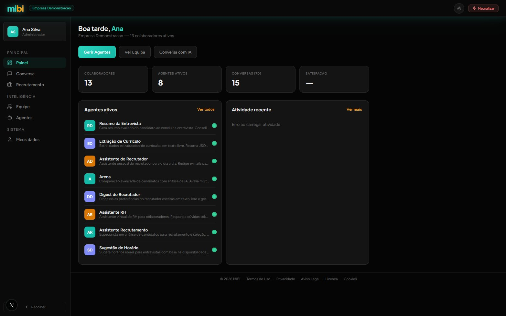
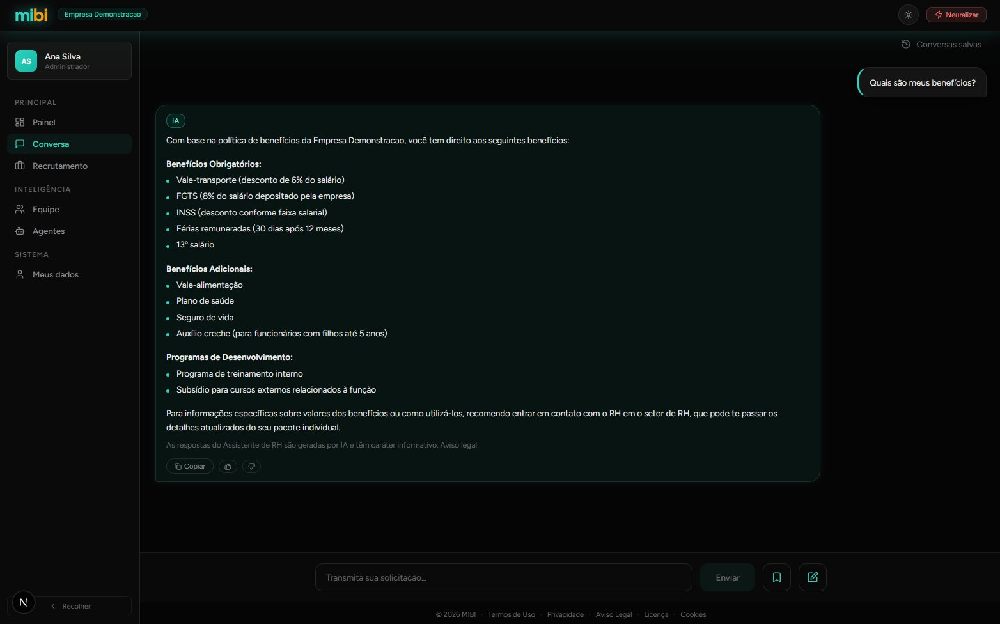
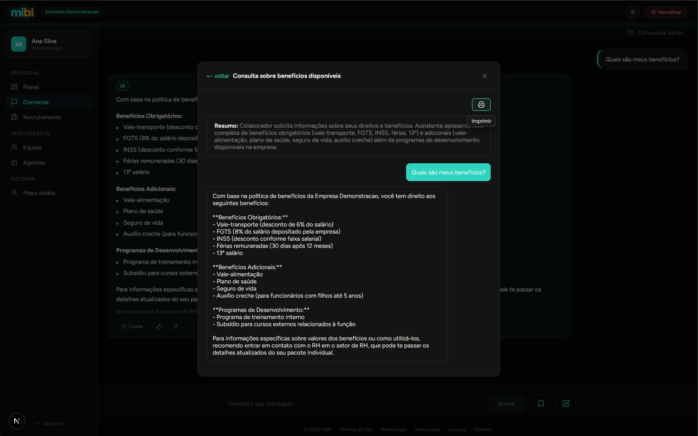
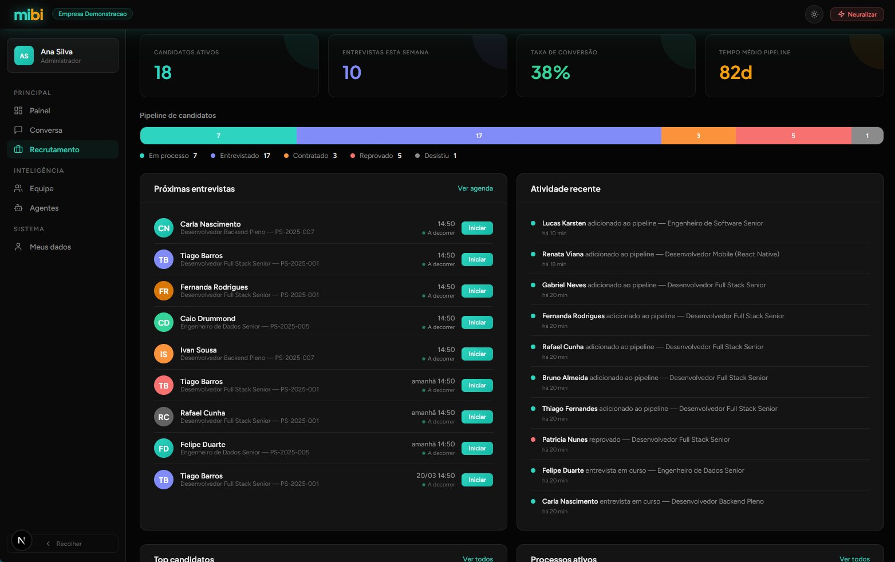
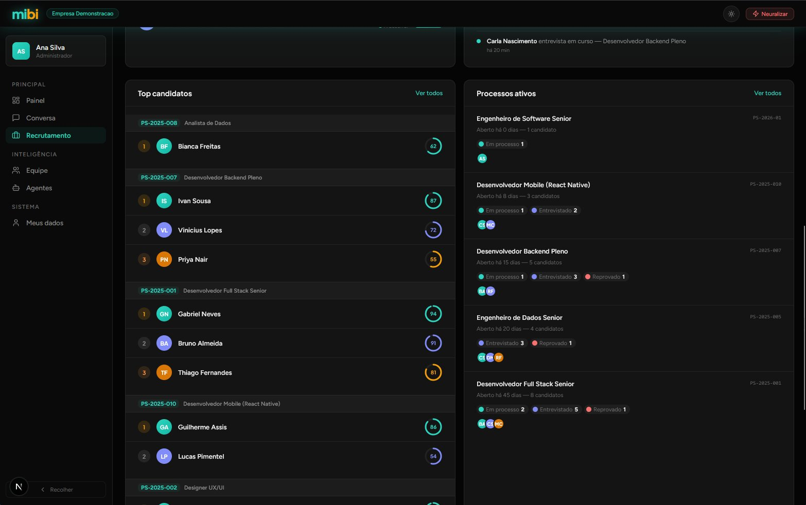
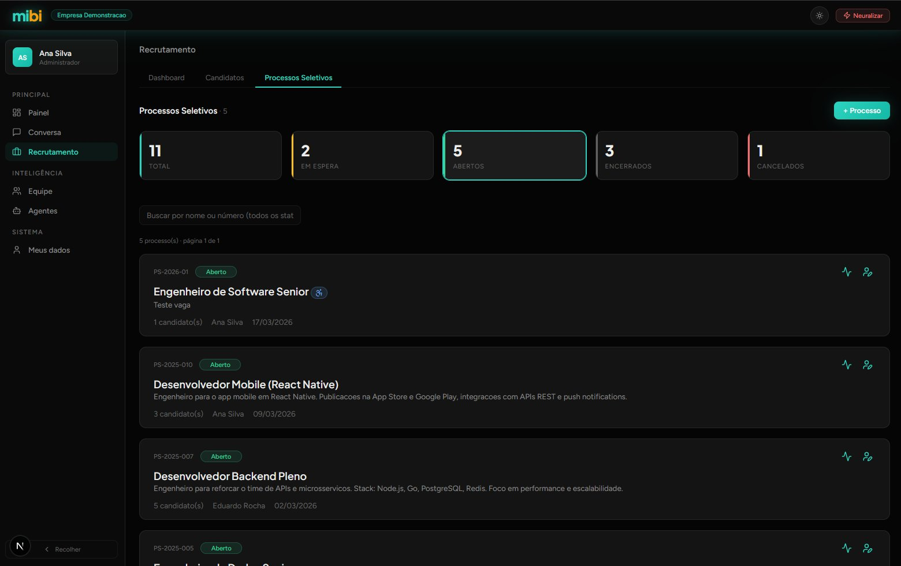
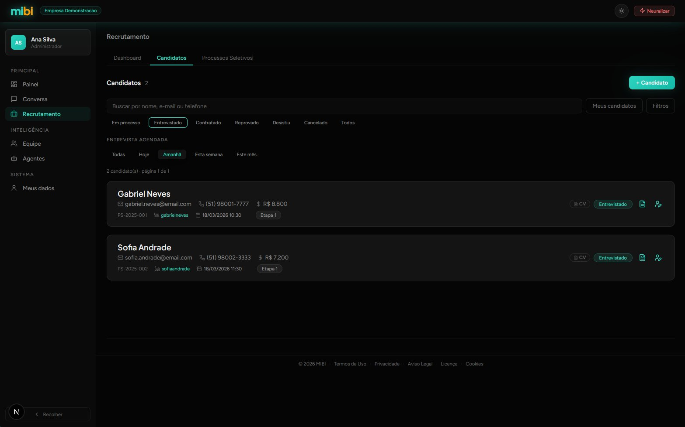
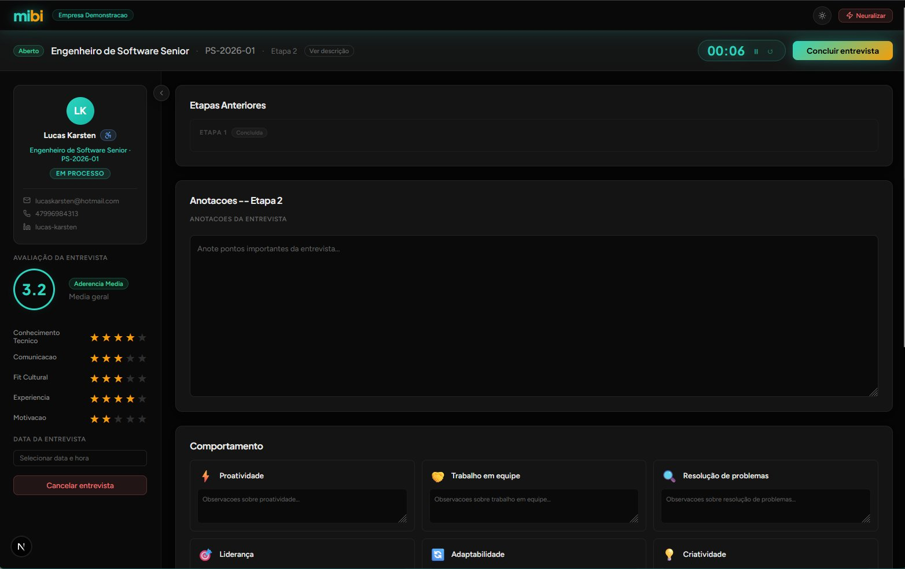

# mibi

### Inteligência artificial para o RH da sua empresa

Recrutamento estruturado, assistente de RH com IA e gestão de equipe — tudo em um ambiente isolado por empresa, com privacidade real e conformidade com a LGPD.

 

&nbsp;&nbsp;

 

> **Dados fictícios.** Todos os nomes, vagas, candidatos e métricas nas capturas de tela são gerados para demonstração.

---

## Por que o mibi?

Times de RH perdem horas respondendo as mesmas perguntas, acompanhando candidatos em planilhas e conduzindo entrevistas sem estrutura. O mibi elimina esse retrabalho com IA integrada ao fluxo real de trabalho.

Cada empresa opera em um **ambiente completamente isolado** — schema dedicado no banco, agentes próprios, dados que nunca se misturam com os de outra organização. Privacidade por arquitetura, não por configuração.

---

## Para quem

- **Times de RH** que querem escalar atendimento sem aumentar a equipe
- **Recrutadores** que precisam de processo, não de planilhas
- **Empresas** que levam privacidade de dados a sério e precisam de conformidade LGPD

---

## Assistente de RH com IA

O colaborador pergunta, a IA responde — com o contexto real da empresa: benefícios, políticas internas, férias, folha de pagamento. Sem abrir chamado, sem esperar o RH.

O assistente usa a base de conhecimento configurada pela própria empresa. Cada resposta inclui aviso legal e pode ser copiada com um clique. O colaborador avalia com thumbs up/down — esse feedback alimenta o aprendizado contínuo do agente.

Conversas podem ser salvas como **snapshots** com resumo gerado por IA, impressas ou compartilhadas — útil para registros de decisão e processos internos.

---

## Recrutamento completo com IA

Do processo aberto ao candidato contratado — com inteligência artificial analisando em cada etapa.

### Visão geral do pipeline

Candidatos ativos, entrevistas conduzidas, taxa de conversão e atividade recente — tudo em tempo real.

### Score Mibi

O mibi pontua candidatos em três dimensões — **técnica**, **comportamental** e **holística** — com pesos configuráveis por processo. O score evolui conforme as etapas avançam: triagem, pós-entrevista e análise final por IA. O recrutador identifica os melhores perfis sem ler currículo por currículo.

### Processos seletivos

Crie e gerencie processos com controle de status: `Aberto`, `Em espera`, `Encerrado` e `Cancelado`. Cada processo tem responsável, histórico completo de candidatos e configuração independente de scoring.

### Candidatos

Cadastre, busque e filtre candidatos por status, etapa e data de entrevista. Upload de currículo com análise automática por IA — o sistema extrai dados estruturados e gera um parecer sem entrada manual.

Ciclo de vida: **Em processo → Entrevistado → Contratado / Reprovado / Desistiu**.

### Painel de entrevista

Ambiente dedicado para conduzir entrevistas com estrutura. O recrutador vê o perfil completo do candidato, avalia por dimensões (técnica, comunicação, cultura, experiência, motivação) e registra observações em tempo real.

Cronômetro de sessão sempre visível. Ao concluir, o candidato avança para `Entrevistado` e o sistema oferece geração de resumo por IA.

---

## Agentes de IA configuráveis

Cada empresa configura seus próprios agentes de IA, baseados em templates que evoluem com o uso. O feedback dos colaboradores alimenta um sistema de digest anônimo — os agentes ficam mais precisos sem comprometer a privacidade de ninguém.

| Agente | Função |
| --- | --- |
| **Assistente de RH** | Responde dúvidas sobre benefícios, férias, políticas internas e folha de pagamento |
| **Assistente de Recrutamento** | Analisa candidatos, sugere perguntas e gera pareceres estruturados |
| **Assistente do Recrutador** | Apoia o recrutador durante entrevistas com contexto de preferências |
| **Digest do Recrutador** | Processa preferências do recrutador e as injeta nos demais agentes |

Todos os agentes incluem proteção contra prompt injection, anti-hallucination com frases de fallback, e protocolos para situações sensíveis (assédio, demissão, saúde, denúncias).

---

## Privacidade e LGPD

O mibi é **operador de dados** nos termos da LGPD. As empresas clientes são as controladoras — e essa distinção define toda a arquitetura.

- **Isolamento real** — cada empresa tem schema PostgreSQL dedicado; zero compartilhamento entre tenants
- **Retenção configurável** — cada empresa define por quanto tempo os dados de candidatos são mantidos
- **Direitos do titular** — exportação e exclusão de dados pessoais
- **Audit log** — registro de operações de IA e decisões sobre dados (LGPD Art. 20)
- **Disclaimer de IA** — toda resposta gerada inclui aviso legal; decisões automatizadas são passíveis de revisão humana
- **Aceite de termos** — versionado e registrado no onboarding

Documentação legal completa: [mibi-legal](https://github.com/lucaskarsten/mibi-legal)

---

## Planos

|  | Free | Starter | Pro | Enterprise |
| --- | --- | --- | --- | --- |
| Funcionários | 5 | 25 | Ilimitado | Negociado |
| Agentes IA | — | 1 | Todos | Customizados |
| Processos seletivos | — | 2 ativos | Ilimitado | Ilimitado |
| Painel de entrevistas | — | — | ✓ | ✓ |
| SSO | — | — | — | ✓ |
| White-label | — | — | — | ✓ |
| Suporte | — | E-mail | Prioritário | Dedicado |

Trial de 14 dias no Pro, sem cartão obrigatório. Pagamento mensal ou anual via Stripe (cartão, Pix, boleto).

---

## Experimente agora

|  |  |
| --- | --- |
| **URL** | [experimente.mibi.app.br](https://experimente.mibi.app.br) |
| **Admin** | `ana@demonstracao.com` — gestão de equipe, agentes e configurações |
| **Membro** | `rafael@demonstracao.com` — chat com assistente de RH |
| **Recrutador** | `beatriz@demonstracao.com` — processos, candidatos e entrevistas |
| **Senha** | `123456` |

> Todos os dados do ambiente de teste são **fictícios** e gerados para demonstração.

---

## Roadmap

| Funcionalidade | Status |
| --- | --- |
| Assistente de RH com IA | ✅ Produção |
| Módulo de recrutamento completo | ✅ Produção |
| Painel de entrevista com timer e scoring | ✅ Produção |
| Upload e análise de currículo por IA | ✅ Produção |
| Score Mibi (técnico + comportamental + holístico) | ✅ Produção |
| Snapshots de conversa com resumo por IA | ✅ Produção |
| Perfil de preferências do recrutador | ✅ Produção |
| LGPD e compliance | ✅ Produção |
| Mobile (chat, recrutamento, equipe) | ✅ Produção |
| Comparação de candidatos por IA (side-by-side) | 🔜 Em breve |
| Painel de entrevistas em tempo real | 🔜 Em breve |
| Billing e planos self-service (Stripe) | 🔜 Em breve |
| Endpoints LGPD (exportação e exclusão de dados) | 🔜 Em breve |
| Agente do colaborador (canal direto com a IA) | 📅 Planejado |
| SSO (SAML / OpenID Connect) | 📅 Planejado |
| Dashboards analíticos | 📅 Planejado |
| Onboarding de colaboradores | 📅 Planejado |
| White-label | 📅 Planejado |

Roadmap completo: [ROADMAP.md](ROADMAP.md)

---

## Stack

| Camada | Tecnologia |
| --- | --- |
| Frontend / Backend | Next.js · JavaScript · Pages Router |
| Banco (produção) | PostgreSQL (Neon) |
| Banco (dev) | PostgreSQL local |
| Multi-tenancy | Schema isolado por empresa via `proxy.js` |
| IA | Claude (Anthropic) |
| Design tokens | `theme.css` + Tailwind |
| API | API-first com Swagger |
| Hospedagem | Vercel + Git CI |

Repositório técnico (privado): [lucaskarsten/mibi-core](https://github.com/lucaskarsten/mibi-core)

---

Desenvolvido por **Lucas Karsten** · [mibi.app.br](https://mibi.app.br)
